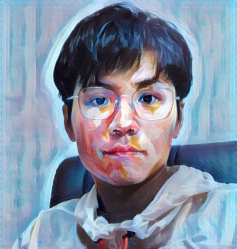

# Kailun Luo 

I am now a lecturer in the Department of Software Engineering,  Dongguan University of Technology (DGUT). 
Before that I got my Ph.D. degree in [Dept.of Computer Science in Sun Yat-sen University](http://sdcs.sysu.edu.cn)

  
  >Address: Dongguan University of Technology, DaXue Road No.1, SongShan Lake, DongGuan, China
  
  >Tel: +86-15915711238
  
  >Email: luokl@dgut.edu.cn

## Currently

I am working on the projects of [Agent Abstraction via forgetting](https://github.com/luokailun/planning-abstraction) and [Synthesis of General Strategies](https://github.com/luokailun/synthesizer)

## Research

My main research area is Knowledge Representation and Reasoning (KRR) in Artificial Intelligence. My research interest is Situation Calculus, Reasoning about Strategies, Verification and Synthesis of General/Generalized Strategies, and the Application of Abstraction Technologies on Formal Verification and Synthesis. 

I am now also interested in Reinforcement Learning, Automated Testing and Formal Verification of Security Protocols.

## Publications

- Kailun Luo and Yongmei Liu. Automated Synthesis of Generalized Invariant Strategies via Counterexample-guided Strategy Refinement. To appear in AAAI-2022. (CCF A, one of the two top-tier conferences in KRR)

- Zhenhe Cui, Yongmei Liu and Kailun Luo. A Uniform Abstraction Framework for Generalized Planning. IJCAI-2021 [(DBLP)](https://dblp.uni-trier.de/pers/hd/l/Luo:Kailun).  (CCF A, one of the two top-tier conferences in KRR)

- Kailun Luo, Yongmei Liu, Yves Lesperance and Ziliang Lin. Agent Abstraction via Forgetting in  the Situation Calculus. ECAI-2020 [(DBLP)](https://dblp.uni-trier.de/pers/hd/l/Luo:Kailun). (CCF B)

- Kailun Luo and Yongmei Liu. Automatic Verification of FSA Strategies via Counterexample-Guided Local Search for Invariants. IJCAI-2019 [(DBLP)](https://dblp.uni-trier.de/pers/hd/l/Luo:Kailun).  (CCF A, one of the two top-tier conferences in KRR)

## Education
- Ph.D., Computer Science, [Sun Yat-sen University](http://sdcs.sysu.edu.cn), 09/2013 - 06/2015 (pre), 09/2015 - 06/2020
- B.Sc., Computer Science, [South China Normal University](http://cs.scnu.edu.cn), 09/2009 - 06/2013

## Activities

Presentations in AAAI-22, ECAI-2020, [IJCAI-19](https://www.ijcai19.org)[(sildes)](kailun_ijcai_2019.pdf), [KRW-2019](http://kr2019.sgmtu.edu.cn), KRW-2016

## Services

- IJCAI-2022 PC member
- IJCAI-2021 PC member

## Courses

### Algorithm Design and Analysis

#### content

- Lecture 1 [(sildes1)](1algo1-1.pdf) [(sildes2)](1algo1-2.pdf)
- Lecture 2 [(sildes)](1algo2.pdf)
- Lecture 3 [(sildes)](1algo3.pdf)
- Lecture 4 [(sildes)](1algo4.pdf)
- Lecture 5 [(sildes)](1algo5.pdf)
- Lecture 6 [(sildes)](1algo6.pdf)
- Lecture 7 [(sildes)](1algo7.pdf)
- Lecture 8 [(sildes)](1algo8.pdf)

#### other materials:

- 中国幕课北航的《算法设计与分析》
- 书籍《算法》 的配套网站 algs4.cs.princeton.edu

